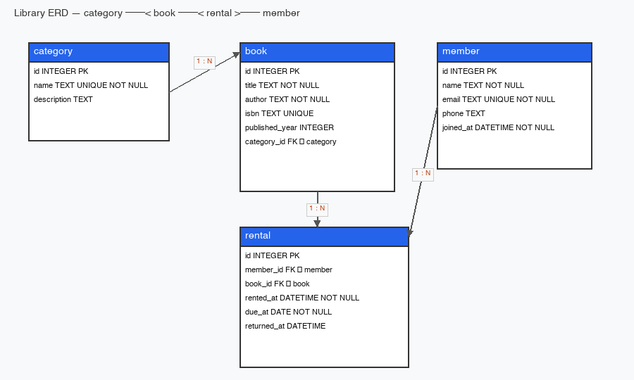

# SQL Database Practice — Library Domain

This repository is a **SQL-only** database practice deliverable for a book-rental (library) domain. It demonstrates a normalized **four-table** schema with **three 1:N relationships**, sample seed data (≥ 10 rows per table), and **15 core queries** with PNG result captures. The target database is **SQLite** (`library.db`); no backend framework is used.

## ERD



**Tables:** `category`, `book`, `member`, `rental`

**Relationships** (from [`docs/plan.md`](./docs/plan.md) §4.1):

```
category ──< book ──< rental >── member
   1       N   1       N    N     1
```

- `category` 1:N `book` — one category groups many books.
- `book` 1:N `rental` — one book can appear in many rental records.
- `member` 1:N `rental` — one member has many rentals.

`rental.returned_at IS NULL` means the book is still out (open rental).

## Stack

| Item | Choice |
| ---- | ------ |
| **DB** | [SQLite](https://www.sqlite.org/) — file-based, no server |
| **Client** | [DBeaver](https://dbeaver.io/) for result-grid captures; `sqlite3` CLI for scripted runs |
| **Design / decisions** | [`docs/plan.md`](./docs/plan.md) |
| **Assignment spec** | [`docs/subject.md`](./docs/subject.md) |

Portable SQL is preferred. Lines that are SQLite-specific are marked with `-- SQLite-specific:` in the SQL files.

## How to Run

From the `05-1.my_db/` directory:

```bash
# 1. (Re)create the database from scratch
rm -f library.db
sqlite3 library.db < sql/01_schema.sql
sqlite3 library.db < sql/02_seed.sql

# 2. Run all 15 queries (prints to stdout in the CLI)
sqlite3 library.db < sql/03_queries.sql
```

**DBeaver:** Open `library.db`, run `sql/01_schema.sql` and `sql/02_seed.sql` once, then execute each query in `sql/03_queries.sql` **in numeric order** (1 → 15). Compare the result grid to the matching file under [`results/`](./results/).

> **Note:** Queries **#13** (`UPDATE`) and **#14** (`DELETE`) change data. For captures that match `results/`, run queries 1–12 first on a fresh seed, then #13–#15. Re-run steps 1–2 above to reset.

## File Layout

```
05-1.my_db/
├── README.md
├── docs/
│   ├── subject.md          # assignment requirements
│   ├── plan.md             # implementation plan & locked decisions
│   ├── bonus_plan.md       # optional bonus tasks
│   ├── erd.png             # entity-relationship diagram
│   └── plans/              # per-phase plans
├── sql/
│   ├── 01_schema.sql       # CREATE TABLE (run first)
│   ├── 02_seed.sql         # INSERT sample data (run second)
│   └── 03_queries.sql      # 15 queries + CREATE INDEX (run third)
├── results/
│   └── q01_*.png … q15_*.png
└── library.db              # build artifact (gitignored; regenerated locally)
```

## 15 Queries at a Glance

| # | Category | Purpose | Capture |
| - | -------- | ------- | ------- |
| 1 | Basic select | List all members sorted by `joined_at DESC`. | [q01](./results/q01_members_by_joined_desc.png) |
| 2 | Basic select | Books published in or after 2015, ordered by year then title. | [q02](./results/q02_books_published_2015_or_later.png) |
| 3 | Basic select | Top 5 most recently rented books. | [q03](./results/q03_top5_recent_rentals.png) |
| 4 | Basic select | Members whose email ends with `@example.com`. | [q04](./results/q04_members_example_com_email.png) |
| 5 | INNER JOIN | Each rental with member name and book title. | [q05](./results/q05_rental_member_book_inner_join.png) |
| 6 | INNER JOIN | Each book with its category name. | [q06](./results/q06_book_with_category_inner_join.png) |
| 7 | LEFT JOIN | All members and rental counts (including zero rentals). | [q07](./results/q07_member_rental_count_left_join.png) |
| 8 | INNER JOIN + filter | Currently open rentals (`returned_at IS NULL`). | [q08](./results/q08_open_rentals_currently_out.png) |
| 9 | Aggregate | Books per category (`COUNT` + `GROUP BY`). | [q09](./results/q09_books_per_category_count.png) |
| 10 | Aggregate | Rentals per member with more than one rental (`HAVING`). | [q10](./results/q10_rentals_per_member_having.png) |
| 11 | Aggregate | Average rental duration (days) per category (`AVG`, returned only). | [q11](./results/q11_avg_rental_duration_per_category.png) |
| 12 | Subquery | Members who rented more than the average member. | [q12](./results/q12_members_above_avg_rentals_subquery.png) |
| 13 | UPDATE | Mark open rental #2 as returned. | [q13](./results/q13_update_return_rental.png) |
| 14 | DELETE | Archive returned rentals older than one year. | [q14](./results/q14_delete_archive_old_rentals.png) |
| 15 | Index | `CREATE INDEX idx_rental_member_rented` on `rental(member_id, rented_at)`. | [q15](./results/q15_create_index_done.png) |

Full SQL and one-line comments: [`sql/03_queries.sql`](./sql/03_queries.sql).

## Subject Mapping

| Subject ref | Requirement | Where it lives |
| ----------- | ----------- | -------------- |
| [§2.1](docs/subject.md) | Domain DB design (≥ 4 tables, ≥ 2 1:N) | [`sql/01_schema.sql`](./sql/01_schema.sql), [`docs/plan.md`](./docs/plan.md) §4, [`docs/erd.png`](./docs/erd.png) |
| [§2.2](docs/subject.md) | Schema creation script | [`sql/01_schema.sql`](./sql/01_schema.sql) |
| [§2.3](docs/subject.md) | Sample data (≥ 10 rows/table) | [`sql/02_seed.sql`](./sql/02_seed.sql) |
| [§2.4](docs/subject.md) | 15 queries + result captures | [`sql/03_queries.sql`](./sql/03_queries.sql), [`results/`](./results/) |
| [§4.1](docs/subject.md) | DB choice + portability | **Stack** (above), `-- SQLite-specific:` in [`sql/`](./sql/) |
| [§4.2](docs/subject.md) | Schema (PK, FK, 1:N, types) | [`sql/01_schema.sql`](./sql/01_schema.sql) |
| [§4.3](docs/subject.md) | NOT NULL, UNIQUE, FK blocks orphans | [`sql/01_schema.sql`](./sql/01_schema.sql), **Verifying constraints** (below) |
| [§4.4](docs/subject.md) | Realistic seed, parents before children | [`sql/02_seed.sql`](./sql/02_seed.sql) |
| [§4.5](docs/subject.md) | 15 queries, coverage matrix | [`sql/03_queries.sql`](./sql/03_queries.sql) (footer tally) |
| [§4.6](docs/subject.md) | One-line description + verifiable results | `-- Query NN:` comments, [`results/qNN_*.png`](./results/) |
| [§4.7](docs/subject.md) | Submission structure + optional ERD | Layout (above), [`docs/erd.png`](./docs/erd.png) |

## Verifying Constraints

After seeding (`01_schema.sql` + `02_seed.sql`), these commands must **fail** (proving constraints are enforced):

```bash
# FK enforcement (expect: FOREIGN KEY constraint failed)
sqlite3 library.db "PRAGMA foreign_keys = ON; \
  INSERT INTO rental (member_id, book_id, rented_at, due_at) \
  VALUES (9999, 9999, '2026-01-01 00:00:00', '2026-01-15');"

# UNIQUE enforcement (expect: UNIQUE constraint failed: member.email)
sqlite3 library.db "INSERT INTO member (name, email, joined_at) \
  VALUES ('Dup', 'alice.kim@example.com', '2026-01-01');"
```

SQLite disables foreign-key checks by default; every SQL file in this repo starts with `PRAGMA foreign_keys = ON;`.

## Known Limitations

- **FK enforcement** requires `PRAGMA foreign_keys = ON;` in SQLite (included at the top of each `.sql` file).
- **Query #11** uses `julianday(...)` for day differences — SQLite-specific; a portable alternative is noted in [`sql/03_queries.sql`](./sql/03_queries.sql).
- **Query #13 / #14** mutate `rental` rows; reset the DB before re-running earlier queries or re-capturing results.
- **Sample data** uses placeholder emails (`@example.com`) and phone numbers — no real PII.

## Bonus

See [`docs/bonus_plan.md`](./docs/bonus_plan.md) for join-vs-subquery comparison, integrity experiments, and the mini metrics report (subject §5).
